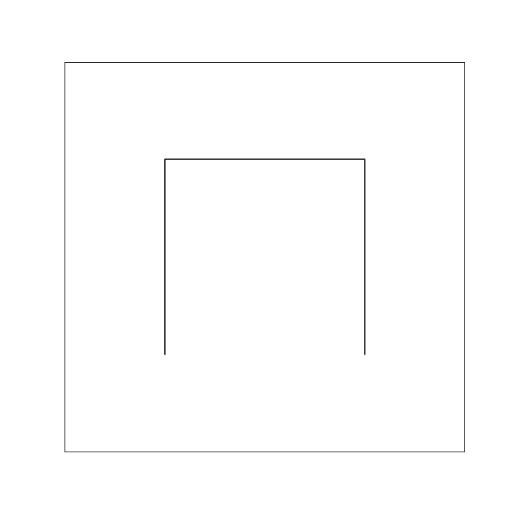
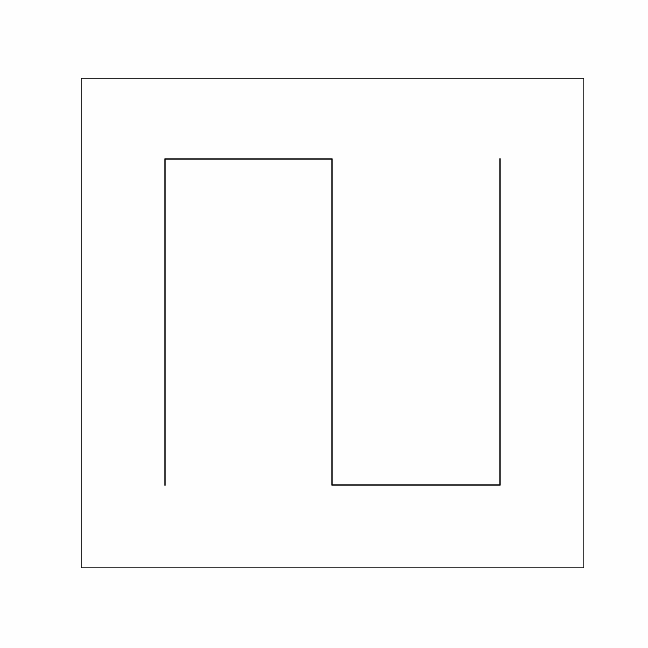
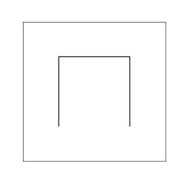
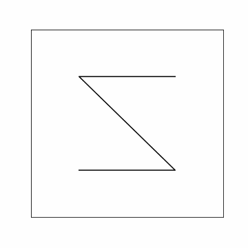

# Terminology

**Space-filling curve** is a curve which maps a unit line segment to a continuous curve in the unit n-dimensional cube.

**Fraction** is an n-dimensional subcube, which is some partition of an n-dimensional cube.

**Genus** is the number of fractions of the first partition of an n-dimensional cube.

**Monofractal** - a curve constructed using one recurrent formula**

**Polyfractal** - a curve constructed with the help of several recurrent formulas.

**Prototype** is a way of passing through the fractions of the first partition of an n-dimensional cube.

**Basic transformation** is the operation that performs an isometric transformation of a fraction (rotation, reflection and/or reverse).

To define a curve means to specify its prototype and the sequence of basic transformations.

# Hilbert curve

Hilbert curve is mono-fractal curve [1]. Let ${\bf i} = (1,0)$, ${\bf j} = (0,1)$ and ${\bf I} = (-1,0)$, ${\bf J} = (0,-1)$ then the prototype $P_n$ chain code for the Hilbert curve is $P_0 = {\bf jiJ}$. The recursive formula describing this curve has the form:

$$P_{n+1} = ji(P_n),\text{ }{\bf j},\text{ }ij(P_n),\text{ }{\bf i},\text{ }ij(P_n),\text{ }{\bf J},\text{ }JI(P_n).$$

Basic transformation $ji(P_n)\to ij$ means that $j\to i$, $i \to j$ and $J\to I$, $I \to J$ for $P_n$. 

Basic transformation $JI(P_n)\to ij$ means that $J\to i$, $I \to j$ and $j\to I$, $i \to J$ for $P_n$. 

It transforms the coordinates as follows:

$$ji(P_n)=\begin{pmatrix}
j& i\\
y_1& x_1 \\
y_2& x_2 \\
\ldots& \ldots \\
y_m& x_m
\end{pmatrix},
\qquad\qquad
JI(P_n)=\begin{pmatrix}
J& I\\
-y_1& -x_1 \\
-y_2& -x_2 \\
\ldots& \ldots \\
-y_m& -x_m
\end{pmatrix}.
$$

Permuting the letters in the base transformation is equivalent to permuting the columns in the matrix, and changing the letter case is equivalent to multiplying by -1.

# Peano curve

Peano curve is mono-fractal curve [2]. Prototype chain code for the Peano curve is $P_0 = {\bf jjiJJijj}$. The recursive formula describing this curve has the form:

$$P_{n+1} = ij(P_n),\text{ }{\bf j},\text{ }Ij(P_n),\text{ }{\bf j},\text{ }ij(P_n),\text{ }{\bf i},\text{ }iJ(P_n),\text{ }{\bf J},\text{ }IJ(P_n),\text{ }{\bf J},\text{ }iJ(P_n),\text{ }{\bf i},\text{ }ij(P_n),\text{ }{\bf j},\text{ }Ij(P_n),\text{ }{\bf j},\text{ }ij(P_n).$$

# H curve

Н curve is trangular curve. It was first obtained by Niedermeier R., Reinhardt K. and Sanders P. [3]. Prototype chain code for the H curve is $P_0 = {\bf j}$. The recursive formula describing this curve has the form:

$$P_{n+1} = ij(P_n),\text{ }{\bf j},\text{ }\overline{iJ}(P_n),\text{ }{\bf i},\text{ }\overline{Ij}(P_n),\text{ }{\bf i},\text{ }ij(P_n).$$

The curve is completed to a square according to the following rule:

$$L = ij(P_n),\text{ }{\bf i},\text{ }IJ(P_n).$$

The line above the base transforms means reversal. This operation consists in changing the case of the letters of the base transformation and passing in the reverse order $P_n$.

It transforms the coordinates as follows:

$$\overline{iJ}(P_n)=\begin{pmatrix}
i& J\\
-x_m& y_m \\
\ldots& \ldots \\
-x_2& y_2 \\
-x_1& y_1
\end{pmatrix},
\qquad\qquad
\overline{Ij}(P_n)=\begin{pmatrix}
I& j\\
x_m& -y_m \\
\ldots& \ldots \\
x_2& -y_2 \\
x_m& -y_m
\end{pmatrix}.
$$

Changing the case of the letters of the base transformation is equivalent to multiplying the matrix by -1 and passing in the reverse order $P_n$ is equivalent to passing each column of the matrix in reverse order.

# $\beta\Omega$ curve

$\beta\Omega$ curve is bi-fractal curve. It was first obtained by Jens-Michael Wierum [4]. Prototype chain codes for the $\beta\Omega$ curve are $P_0^{(0)} = {\bf jiJ}$ and $P_0^{(1)} = {\bf jiJ}$. The recursive formulas describing this curve has the form:

$$P_{n+1}^{(0)} = iJ(P_n^{(1)}),\text{ }{\bf j},\text{ }Ji(P_n^{(1)}),\text{ }{\bf i},\text{ }\overline{ji}(P_n^{(1)}),\text{ }{\bf J},\text{ }\overline{IJ}(P_n^{(1)}),$$

$$P_{n+1}^{(1)} = iJ(P_n^{(1)}),\text{ }{\bf j},\text{ }Ji(P_n^{(1)}),\text{ }{\bf i},\text{ }\overline{ji}(P_n^{(1)}),\text{ }{\bf J},\text{ } jI(P_n^{(0)}).$$

 

# $AR^2W^2$ curve

$AR^2W^2$ curve is tetra-fractal curve. It was first obtained by T. Asano, D. Ranjan, T. Roos, E. Welzl and P. Widmayer [5]. Prototype chain codes for the $AR^2W^2$ curve are $P_0^{(0)} = {\bf i,Ij,i}$, $P_0^{(1)} = {\bf jiJ}$, $P_0^{(2)} = {\bf jiJ}$ and $P_0^{(3)} = {\bf jiJ}$. The recursive formulas describing this curve has the form:

$$P_{n+1}^{(0)} = ij(P_n^{(3)}),\text{ }{\bf i},\text{ }\overline{jI}(P_n^{(1)}),\text{ }{\bf Ij},\text{ }Ji(P_n^{(2)}),\text{ }{\bf i},\text{ }iJ(P_n^{(1)}),$$

$$P_{n+1}^{(1)} = ji(P_n^{(3)}),\text{ }{\bf j},\text{ }\overline{Ij}(P_n^{(2)}),\text{ }{\bf i},\text{ }ij(P_n^{(1)}),\text{ }{\bf J},\text{ }JI(P_n^{(1)}),$$

$$P_{n+1}^{(2)} = ji(P_n^{(0)}),\text{ }{\bf j},\text{ }Ji(P_n^{(1)}),\text{ }{\bf i},\text{ }jI(P_n^{(0)}),\text{ }{\bf J},\text{ }JI(P_n^{(1)}),$$

$$P_{n+1}^{(3)} = ij(P_n^{(0)}),\text{ }{\bf j},\text{ }Ji(P_n^{(2)}),\text{ }{\bf i},\text{ }jI(P_n^{(0)}),\text{ }{\bf J},\text{ }\overline{Ji}(P_n^{(3)}),$$

 
 

# Reference

[1] D. Hilbert, Über die stetige Abbildung einer Linie auf ein Flächenstück, Math. Ann. 38 (3) (1891) 459–460.

[2] G. Peano, Sur une courbe, qui remplit toute une aire plane, Math. Ann. 36 (1) (1890) 157–160.

[3] R. Niedermeier, K. Reinhardt, P. Sanders, Towards optimal locality in mesh-indexings, Discrete Applied Mathematics 117 (2002) 211–237.

[4] J.-M. Wierum, Definition of a new circular space-filling curve: $\beta\Omega$-indexing, Technical Report TR-001-02, Paderborn Center for Parallel Computing
(PC2), 2002.

[5] T. Asano, D. Ranjan, T. Roos, E. Welzl, P. Widmayer, Space-filling curves and their use in the design of geometric data structures, Theoretical Computer
Science 181 (1) (1997) 3–15.

